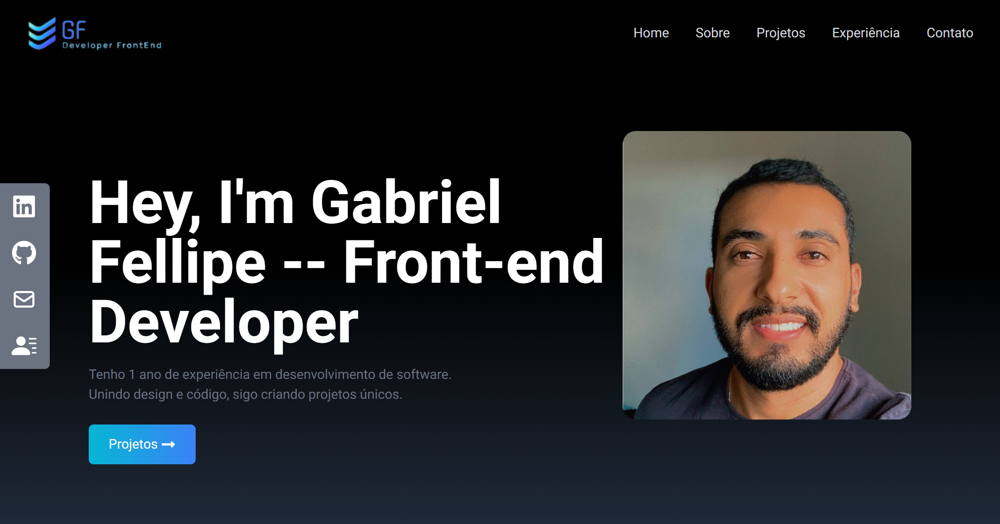

<h1 align="center">Gabriel Fellipe - Portfólio</h1>

  <a href="#-tecnologias">Tecnologias</a>&nbsp;&nbsp;&nbsp;|&nbsp;&nbsp;&nbsp;
  <a href="#-projeto">Projeto</a>&nbsp;&nbsp;&nbsp;|&nbsp;&nbsp;&nbsp;
  <a href="#memo-licença">Licença</a>

  

 

  

## 🚀 Tecnologias Utilizadas

Esse projeto foi desenvolvido com as seguintes tecnologias:

- ReactJS: Biblioteca JavaScript para a construção de interfaces de usuário.

- Tailwind CSS: Uma estrutura de design-first sem opiniões para o desenvolvimento web.

- Getform: Serviço para facilitar o recebimento de e-mails e formulários.

## 📑 Estrutura do Projeto

- A estrutura do projeto está organizada da seguinte forma:

- src/components: Componentes React reutilizáveis.

## 💻 Projeto

Bem-vindo ao meu portfólio! Apresento com entusiasmo o meu projeto mais recente, desenvolvido utilizando ReactJS, Tailwind CSS e integrado com Getform. Este projeto é um reflexo da minha paixão pelo desenvolvimento web moderno e da minha habilidade em criar experiências interativas e eficientes.

## ⚙️ Funcionalidades

- Componentização Dinâmica: Utilizando ReactJS, criei componentes dinâmicos para uma experiência de usuário fluida e interativa.

- Estilização Eficiente: O Tailwind CSS foi empregado para estilizar a aplicação de forma responsiva, assegurando uma apresentação visualmente atraente em diversas plataformas.

- Gestão Simplificada de Formulários: A integração perfeita com o Getform simplificou a coleta e gerenciamento de dados, garantindo uma interação suave com o usuário.

## ❣️ Contribuição

Sinta-se à vontade para contribuir com melhorias, correções de bugs ou novas funcionalidades. Abra uma issue para discutir ideias e sugestões, ou envie um pull request.

Esperamos que este projeto seja útil para o gerenciamento eficiente do tempo, combinando a técnica Pomodoro com um histórico detalhado das tarefas realizadas. Se tiver alguma dúvida ou sugestão, não hesite em entrar em contato. Aproveite o desenvolvimento!

## :memo: Licença

Esse projeto está sob a licença MIT.

---

Feito com ♥ by Gabriel F. :wave:
